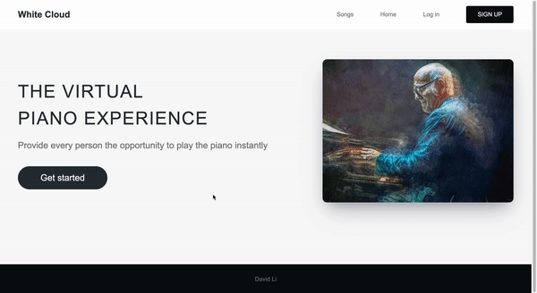

# White Cloud
White Cloud will be a virtual platform that lets you explore piano music and experiences with your computer keyboard.

## Preview

## Tech Stack
- 
- 
- 
- 
- 
- 
- 

## Setup
- `git clone git@github.com:davdli/White_Cloud.git` in terminal
- `npm install` and `npm start` in project root directory
